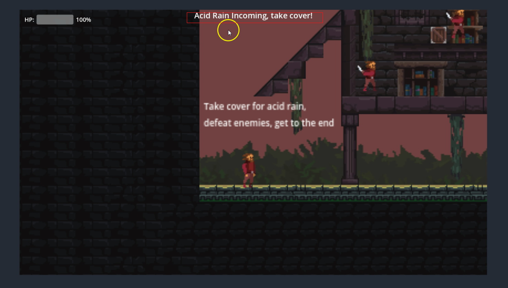
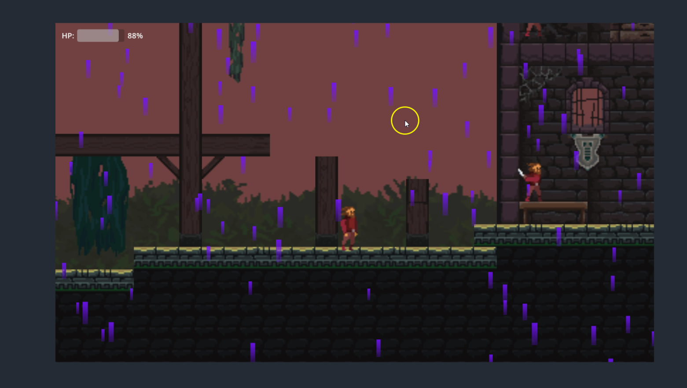

# IMG 420 Final Project

For this project we have built a GDExtension which adds an AcidRainManager node, which implements an acid rain mechanic by keeping a global cycling state that can be responded to by UI and game objects, as well as an exposure tracking system which will determine if an entity is protecting from the rain. In our game prototype, you must complete several platforming challenges and defeat enemies while trying to avoid the acid rain. Your goal is to reach the end safe zone.

Video demonstration link: https://www.youtube.com/watch?v=MOgM8YkqAoM

## Game Prototype Screenshots

## Documentation
For documentation, including build instructions, user guide, and API reference, go [here.](/game_prototype/docs)